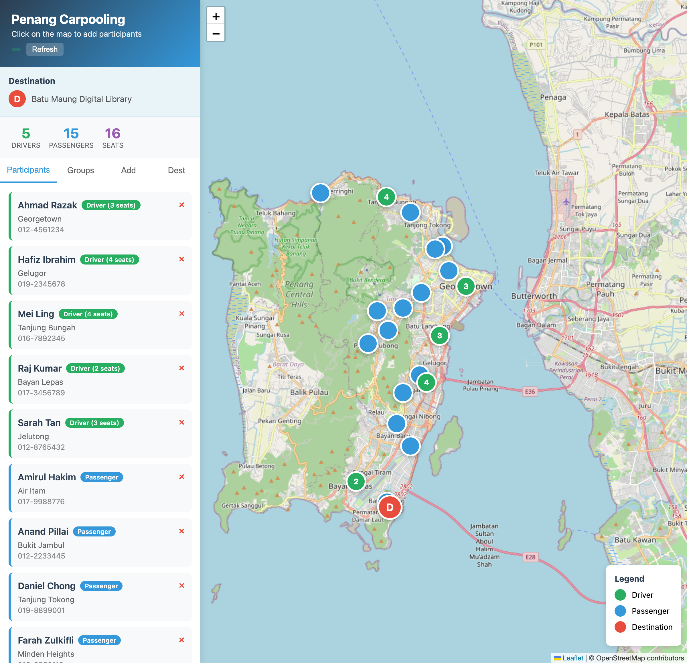
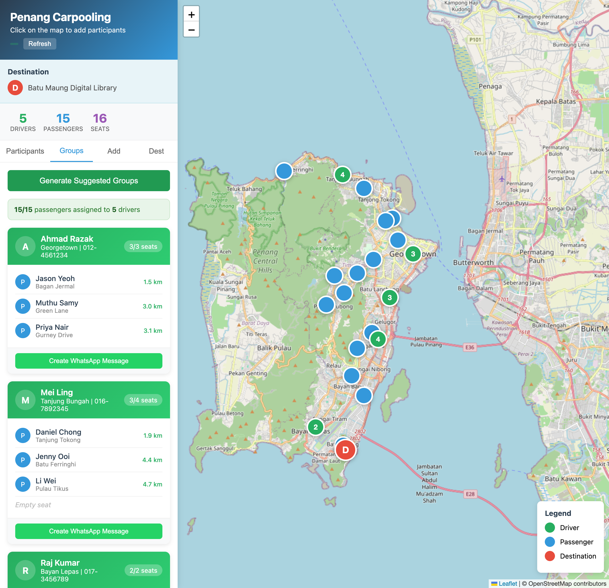
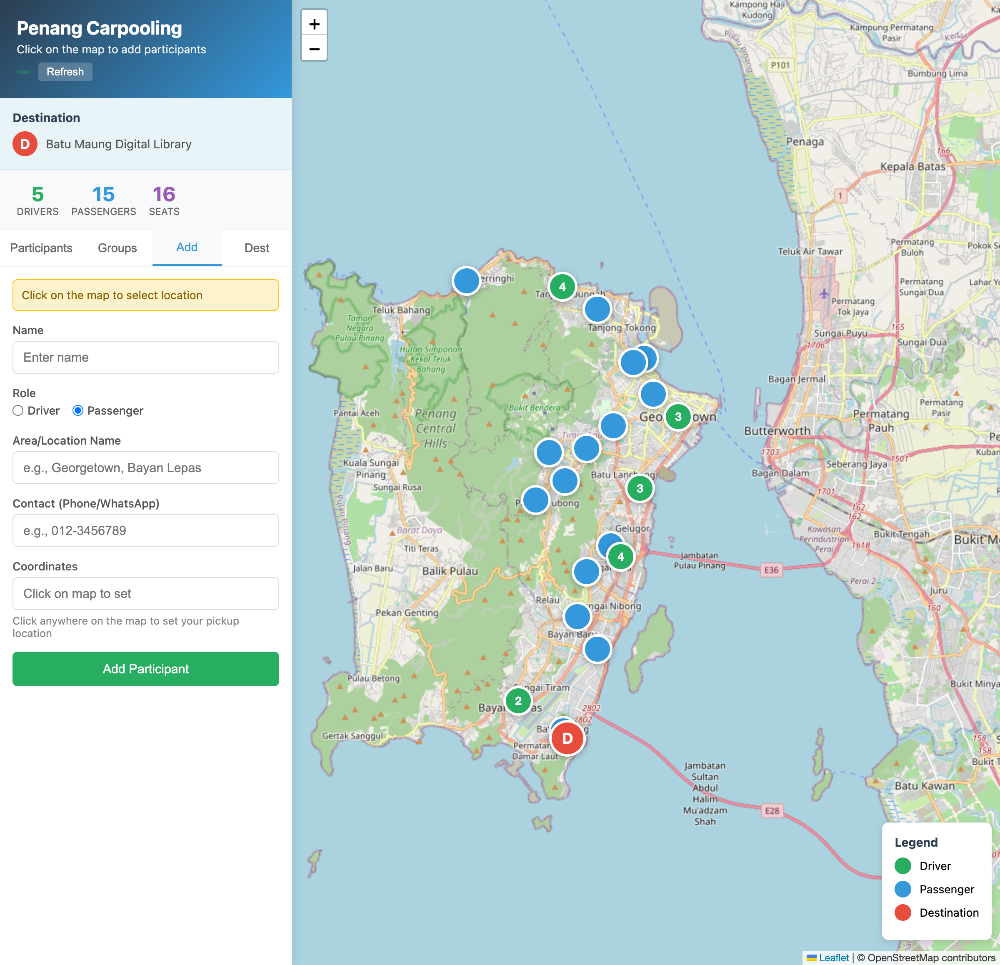
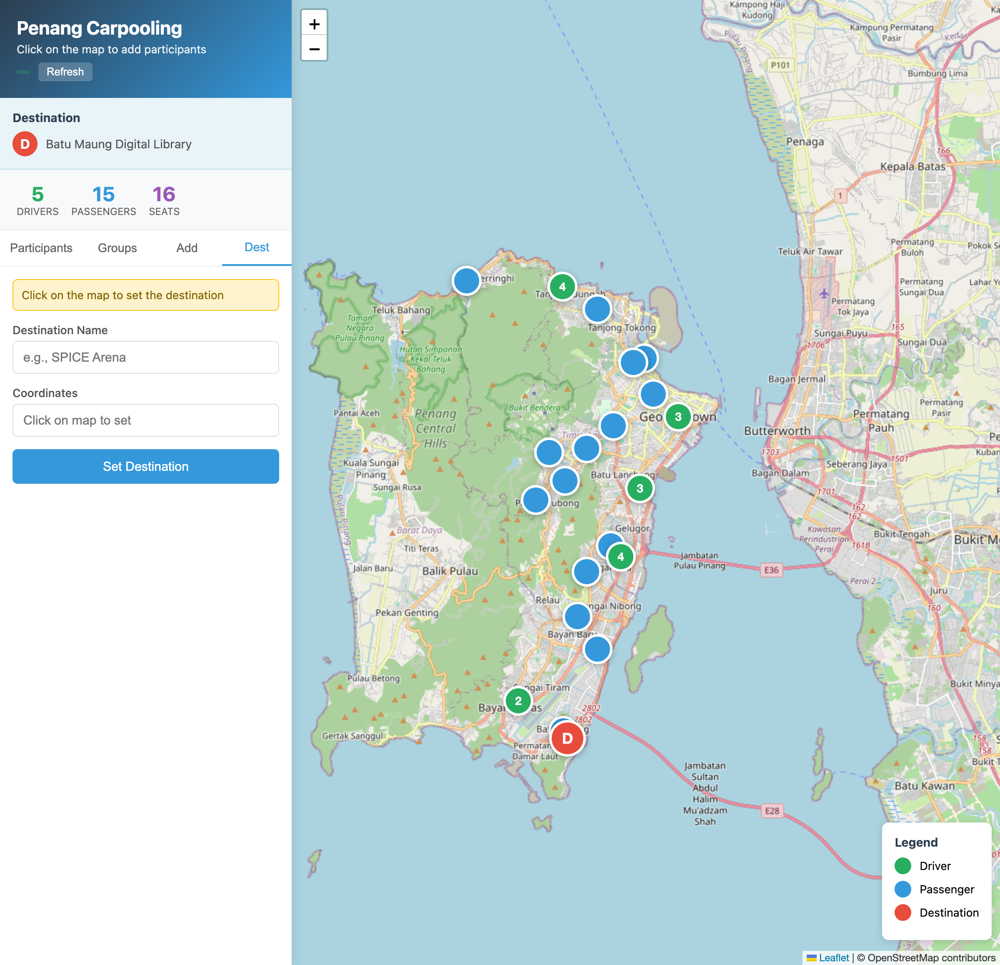

# Penang Carpooling App - User Guide

A visual map-based tool for organizing ad-hoc carpooling among participants scattered across Penang Island.

**Live App:** https://kokyoongee.github.io/penang-carpool/

---

## Overview

This app helps organize carpooling by:
- Showing all participants on an interactive map
- Distinguishing between drivers (green markers) and passengers (blue markers)
- Auto-generating carpool groups based on proximity
- Creating ready-to-share WhatsApp messages for coordination

### Dashboard Stats
At the top of the sidebar, you'll see:
- **Drivers** - Total number of drivers available
- **Passengers** - Total number of passengers needing rides
- **Seats** - Total available seats across all drivers

---

## Tab 1: Participants

The **Participants** tab shows a list of all registered participants.

### Features:
- **Driver cards** (green border) show the driver's name, location, contact, and available seats
- **Passenger cards** (blue border) show the passenger's name, location, and contact
- **Click any card** to zoom to that person's location on the map
- **Delete button (×)** removes a participant from the list

### Share Data
At the bottom of the Participants tab:
- **Copy JSON** - Export all data to clipboard for backup
- **Import JSON** - Import data from a JSON string

---

## Tab 2: Groups (Auto-Grouping)

The **Groups** tab automatically suggests carpool arrangements.

### How it works:
1. Click **"Generate Suggested Groups"** button
2. The algorithm assigns passengers to the nearest available driver
3. Each group card shows:
   - Driver info (name, location, contact)
   - Seat capacity (e.g., "3/3 seats")
   - Assigned passengers with distance from driver
   - Empty seats if any remain

### WhatsApp Integration
Each group has a **"Create WhatsApp Message"** button that generates a pre-formatted message with:
- Event destination
- Driver details
- List of assigned passengers with contacts
- Ready to paste into WhatsApp groups

---

## Tab 3: Add Person

The **Add** tab lets you add new participants.

### Steps to add someone:
1. Click on the **Add** tab
2. **Click on the map** to set the pickup location (coordinates will auto-fill)
3. Fill in the form:
   - **Name** - Participant's name
   - **Role** - Select Driver or Passenger
   - **Area/Location Name** - e.g., "Georgetown", "Bayan Lepas"
   - **Contact** - Phone/WhatsApp number
4. If adding a **Driver**, specify the number of available seats
5. Click **"Add Participant"**

The new marker will appear on the map immediately.

---

## Tab 4: Destination

The **Dest** tab configures the event destination.

### To set/change destination:
1. Click on the **Dest** tab
2. **Click on the map** where the destination is located
3. Enter the **Destination Name** (e.g., "Batu Maung Digital Library")
4. Click **"Set Destination"**

The destination appears as a red marker with "D" on the map.

---

## Data Synchronization

### Online Storage
All data is automatically synced to online storage. Everyone accessing the app sees the same data.

### Refresh Button
Click the **Refresh** button at the top to pull the latest data from the server. Useful when multiple people are adding participants.

### Sync Status
A brief status message appears after save/load operations:
- "Saved!" - Data successfully saved online
- "Synced!" - Data loaded from online storage
- "Load failed - using local" - Fallback to local storage

---

## Map Interactions

### Markers
- **Green circles with numbers** - Drivers (number shows available seats)
- **Blue circles** - Passengers
- **Red circle with "D"** - Destination

### Controls
- **Zoom in/out** - Use + / - buttons or scroll wheel
- **Pan** - Click and drag the map
- **Click marker** - View participant details

### Legend
The legend in the bottom-right corner explains the marker colors.

---

## Typical Workflow

### For Organizers:
1. Set the destination in the **Dest** tab
2. Share the app URL with participants
3. Wait for everyone to add themselves
4. Go to **Groups** tab and generate suggested groups
5. Use WhatsApp messages to coordinate with each group

### For Participants:
1. Open the shared app URL
2. Go to **Add** tab
3. Click your location on the map
4. Fill in your details (name, role, contact)
5. Click "Add Participant"

---

## Tips

- **Drivers should indicate accurate seat counts** (excluding driver's seat)
- **Use the Refresh button** before generating groups to ensure you have the latest data
- **The grouping algorithm prioritizes proximity** - passengers are assigned to the nearest driver with available seats
- **WhatsApp messages include all contact numbers** for easy coordination

---

## Troubleshooting

**Can't see the data?**
- Click the Refresh button
- Check your internet connection

**Map not loading?**
- Refresh the page
- Check if you're blocking external scripts

**Data not saving?**
- Ensure you have internet connectivity
- The app will fall back to local storage if online storage fails

---

## Technical Details

- Built with Leaflet.js for interactive maps
- Uses OpenStreetMap tiles
- Data stored on ExtendsClass.com JSON storage
- Hosted on GitHub Pages
- Works on desktop and mobile browsers
